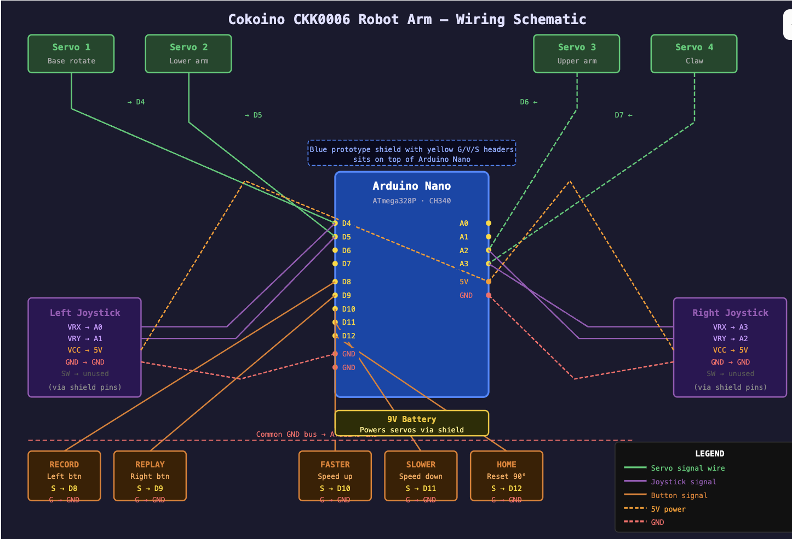

# Jamin's robotic arm project
My project is the robotic arm for arduino, a four jointed robotic arm that can pick items up with a claw gripper. The four joints are four servos that provide torque so that the specific joint can move accordingly to the manual controls. One of my biggest takeaways from this project I would say is the experience of the technical aspects from this project: assembling the hardware, and using the software.


```HTML 
<!--- This is an HTML comment in Markdown -->
<!--- Anything between these symbols will not render on the published site -->
```

| **Engineer** | **School** | **Area of Interest** | **Grade** |
|:--:|:--:|:--:|:--:|
| Jamin Jin | College Champittet | Mechanical/software engineering | entering final year of high school


  
# Final Milestone

**Don't forget to replace the text below with the embedding for your milestone video. Go to Youtube, click Share -> Embed, and copy and paste the code to replace what's below.**

<iframe width="560" height="315" src="https://www.youtube.com/embed/F7M7imOVGug" title="YouTube video player" frameborder="0" allow="accelerometer; autoplay; clipboard-write; encrypted-media; gyroscope; picture-in-picture; web-share" allowfullscreen></iframe>

For your final milestone, explain the outcome of your project. Key details to include are:
- What you've accomplished since your previous milestone
- What your biggest challenges and triumphs were at BSE
- A summary of key topics you learned about
- What you hope to learn in the future after everything you've learned at BSE


# Second Milestone

<iframe width="560" height="315" src="https://www.youtube.com/embed/ygS7DuomMOs?si=GDLErO7HQjZo27Qe" title="YouTube video player" frameborder="0" allow="accelerometer; autoplay; clipboard-write; encrypted-media; gyroscope; picture-in-picture; web-share" referrerpolicy="strict-origin-when-cross-origin" allowfullscreen></iframe>

My second milestone was to add the "playback" feature to my robotic arm where I can record a specific movement of the arm and then replay it later. It works with two buttons, one to control the recording, and one to play the movement recording. The modification was mostly software based as it required coding for the playback feature, but the installation of the buttons also required wiring which did initially confuse me a little since it is the first time that I am using this hardware of the buttons, breadboard, and jumperwires. Something that would need to be completed is improvements upon the fluidity of the movements when being replayed as right now the robotic arm is able to mostly replay/repeat the moevements recorded at the same speed it was moved manually in an acceptable manner but it still has a little bit of a glitch in its movement which I will for sure fix.


# First Milestone

<iframe width="560" height="315" src="https://www.youtube.com/embed/Yc-WTwfIG3U?si=wUh1VxKrHHhFvJl6" title="YouTube video player" frameborder="0" allow="accelerometer; autoplay; clipboard-write; encrypted-media; gyroscope; picture-in-picture; web-share" referrerpolicy="strict-origin-when-cross-origin" allowfullscreen></iframe>

My project is the robotic arm for arduino, to assemble a working, contollable robotic arm with a claw gripper. The parts that this project is composed of is the acrylic peices, the four servos, arduino nano shield, any many other smaller peices that make up and is required for the assembly of this project. The technical progress I have made so far in this project is assembling the physical arm, completing the wiring, and got the manual controls working. Challenges I am facing is one of the servos not providing enough torque causing it to be stuck when lowered too much.

# Schematics 



# Code
Here's where you'll put your code. The syntax below places it into a block of code. Follow the guide [here]([url](https://www.markdownguide.org/extended-syntax/)) to learn how to customize it to your project needs. 

```c++
/*
 * This code applies to cokoino mechanical arm
 * https://github.com/Cokoino/CKK0006
 *
 * Button behavior:
 *   Left press (1st): start recording
 *   Left press (2nd): stop recording
 *   Right press:      replay from recorded start position
 *   Left press (3rd): wipe + start recording again
 *   Left press (4th): stop recording
 *   ...repeats
 */
#include "src/CokoinoArm.h"
#define buzzerPin 3
#define btnLeft   8
#define btnRight  9

CokoinoArm arm;
int xL, yL, xR, yR;

// Increase for longer recordings (each frame = 8 bytes; 50 = 400 bytes)
const int act_max = 50;
int act[act_max][4];
int startPos[4];
int num_do = 0;

// 0 = idle, 1 = recording, 2 = has recording
int recState = 0;

unsigned long lastCapture = 0;
const unsigned long captureInterval = 500; // ms between captured frames

///////////////////////////////////////////////////////////////
void beep(int period_us, int duration_ms) {
  unsigned long end = millis() + duration_ms;
  while (millis() < end) {
    digitalWrite(buzzerPin, HIGH); delayMicroseconds(period_us);
    digitalWrite(buzzerPin, LOW);  delayMicroseconds(period_us);
  }
}
///////////////////////////////////////////////////////////////
void turnUD(void) {
  if (xL != 512) {
    if (0   <= xL && xL <= 100) { arm.up(10);   return; }
    if (900  < xL && xL <=1024) { arm.down(10);  return; }
    if (100  < xL && xL <= 200) { arm.up(20);   return; }
    if (800  < xL && xL <= 900) { arm.down(20);  return; }
    if (200  < xL && xL <= 300) { arm.up(25);   return; }
    if (700  < xL && xL <= 800) { arm.down(25);  return; }
    if (300  < xL && xL <= 400) { arm.up(30);   return; }
    if (600  < xL && xL <= 700) { arm.down(30);  return; }
    if (400  < xL && xL <= 480) { arm.up(35);   return; }
    if (540  < xL && xL <= 600) { arm.down(35);  return; }
  }
}
///////////////////////////////////////////////////////////////
void turnLR(void) {
  if (yL != 512) {
    if (0   <= yL && yL <= 100) { arm.right(0);  return; }
    if (900  < yL && yL <=1024) { arm.left(0);   return; }
    if (100  < yL && yL <= 200) { arm.right(5);  return; }
    if (800  < yL && yL <= 900) { arm.left(5);   return; }
    if (200  < yL && yL <= 300) { arm.right(10); return; }
    if (700  < yL && yL <= 800) { arm.left(10);  return; }
    if (300  < yL && yL <= 400) { arm.right(15); return; }
    if (600  < yL && yL <= 700) { arm.left(15);  return; }
    if (400  < yL && yL <= 480) { arm.right(20); return; }
    if (540  < yL && yL <= 600) { arm.left(20);  return; }
  }
}
///////////////////////////////////////////////////////////////
void turnCO(void) {
  if (xR != 512) {
    if (0   <= xR && xR <= 100) { arm.close(0);  return; }
    if (900  < xR && xR <=1024) { arm.open(0);   return; }
    if (100  < xR && xR <= 200) { arm.close(5);  return; }
    if (800  < xR && xR <= 900) { arm.open(5);   return; }
    if (200  < xR && xR <= 300) { arm.close(10); return; }
    if (700  < xR && xR <= 800) { arm.open(10);  return; }
    if (300  < xR && xR <= 400) { arm.close(15); return; }
    if (600  < xR && xR <= 700) { arm.open(15);  return; }
    if (400  < xR && xR <= 480) { arm.close(20); return; }
    if (540  < xR && xR <= 600) { arm.open(20);  return; }
  }
}
///////////////////////////////////////////////////////////////
void date_processing(int *x, int *y) {
  if (abs(512 - *x) > abs(512 - *y)) { *y = 512; }
  else                                { *x = 512; }
}
///////////////////////////////////////////////////////////////
void checkButtons() {
  // --- LEFT BUTTON ---
  if (digitalRead(btnLeft) == LOW) {
    if (recState == 0 || recState == 2) {
      // Start (or restart) recording
      recState = 1;
      num_do = 0;
      int *p = arm.captureAction();
      for (int i = 0; i < 4; i++) startPos[i] = *(p + i);
      lastCapture = millis();
      beep(200, 150); // short high beep = recording started
    } else {
      // Stop recording
      recState = 2;
      beep(600, 300); // low beep = recording saved
    }
    while (digitalRead(btnLeft) == LOW) {} // wait for release
  }

  // --- CAPTURE FRAME while recording ---
  if (recState == 1 && millis() - lastCapture >= captureInterval) {
    if (num_do < act_max) {
      int *p = arm.captureAction();
      for (int i = 0; i < 4; i++) act[num_do][i] = *(p + i);
      num_do++;
    } else {
      // Buffer full — stop automatically
      recState = 2;
      beep(600, 300);
    }
    lastCapture = millis();
  }

  // --- RIGHT BUTTON: replay ---
  if (digitalRead(btnRight) == LOW && recState == 2) {
    beep(400, 100);
    // Move back to start position
    arm.servo1.write(startPos[0]);
    arm.servo2.write(startPos[1]);
    arm.servo3.write(startPos[2]);
    arm.servo4.write(startPos[3]);
    delay(500);
    // Replay each frame at the same interval it was recorded
    for (int i = 0; i < num_do; i++) {
      arm.servo1.write(act[i][0]);
      arm.servo2.write(act[i][1]);
      arm.servo3.write(act[i][2]);
      arm.servo4.write(act[i][3]);
      delay(captureInterval);
    }
    beep(200, 200);
    while (digitalRead(btnRight) == LOW) {}
  }
}
///////////////////////////////////////////////////////////////
void setup() {
  arm.ServoAttach(4, 5, 6, 7);
  arm.JoyStickAttach(A0, A1, A2, A3);
  pinMode(buzzerPin, OUTPUT);
  pinMode(btnLeft,  INPUT_PULLUP);
  pinMode(btnRight, INPUT_PULLUP);
}
///////////////////////////////////////////////////////////////
void loop() {
  xL = arm.JoyStickL.read_x();
  yL = arm.JoyStickL.read_y();
  xR = arm.JoyStickR.read_x();
  yR = arm.JoyStickR.read_y();
  date_processing(&xL, &yL);
  date_processing(&xR, &yR);
  turnUD();
  turnLR();
  turnCO();
  checkButtons();
}
```

# Bill of Materials
| **Part** | **Note** | **Price** | **Link** |
|:--:|:--:|:--:|:--:|
| Cokoino CKK0006 4-Axis Robotic Arm Kit | Includes Nano, servos, joysticks, acrylic parts, screws | 58 CHF | [Link](https://www.u-buy.ch/en/product/3PUQNSM-lk-cokoino-4-axis-robotic-arm-kit-for-arduino-4dof-mini-desktop-robot-arm-for-children-adults-compliment-engineering-math-science-and-technology-learn?srsltid=AfmBOoq4jKaJOkFeXI5C3a6njOb_Wvns5eEkLJdFX89tzTRQ_EQAxhTh&ref=hm-google-redirect) |
| PureCrea Prototype Shield V3 for Arduino Nano | Breaks out Nano pins for easier wiring | 15.9 CHF | [Link](https://www.galaxus.ch/de/s1/product/purecrea-prototype-shield-v3-fuer-arduino-nano-entwicklungsboard-kit-36688810) |
| Duracell 9V Battery | Powers the servos | ~3 CHF | [Link](https://www.coop-city.ch/de/wohnen-reisen/multimedia/batterien/alkaline-batterien/duracell-batterie-plus-9v6lr61-1-stueck/p/6761135) |
# Other Resources/Examples

- Robotic arm for arduino
- Github: https://github.com/Cokoino/CKK0006/tree/master


To watch the BSE tutorial on how to create a portfolio, click here.
